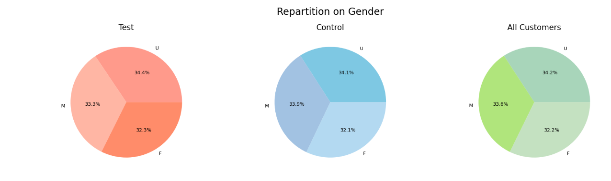
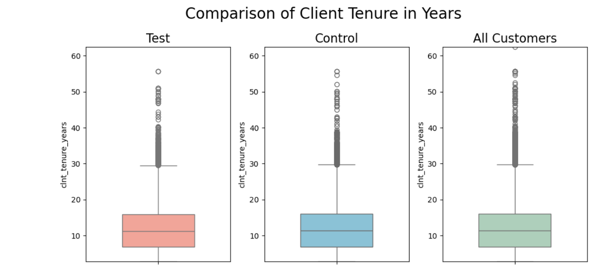
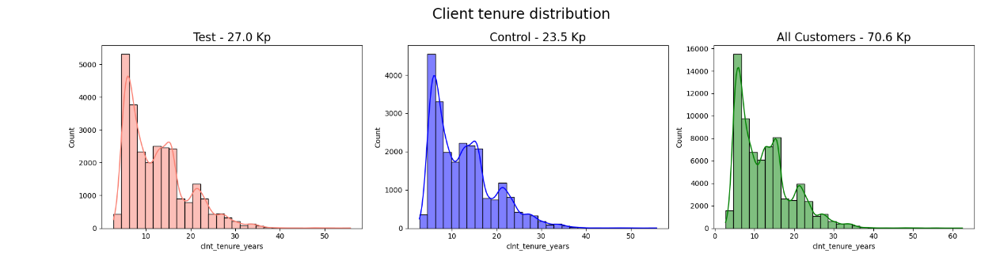

### Vanguard Project 

Created by Benoit MERMEDE and Emmanuel ARON-SAMUEL. 
The goal: 
Do a data analysis process , while applying A/B testing methodology between a Control Group and a Test Group. 

### Sources of data used: 
- df_final_web_data_pt_1.csv   
- df_final_web_data_pt_2.csv   
- df_final_web_data_pt_1_sample.xlsx   
- df_final_experiment_clients.txt
- df_final_demo.txt (calculated)

### A few screenshots of graphs computed:  

  
 
 

